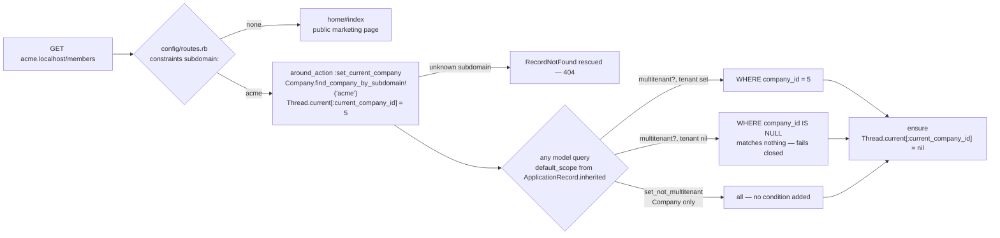
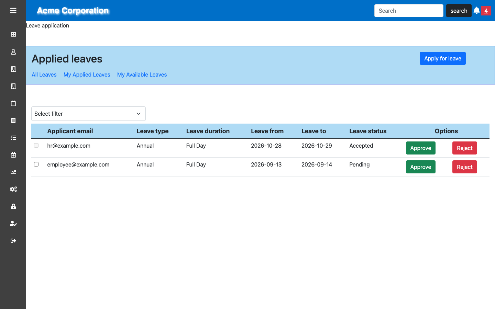

# Stafflow

[](https://github.com/mehboobali98/stafflow/actions/workflows/ci.yml)

A multi-tenant HR management system built with Ruby on Rails. One deployment
serves many companies, each isolated on its own subdomain with its own
employees, org structure, leave policy, benefits and payroll history.

> Originally built as a team project in 2021 under the name PMS. Renamed and
> modernised since. See [ROADMAP.md](ROADMAP.md) for what is planned next and
> [CONTRIBUTING.md](CONTRIBUTING.md) for the branching model.

## Running it

You need Docker. Nothing else — Ruby, MySQL, Node and Elasticsearch all run in
containers.

```sh
git clone git@github.com:mehboobali98/stafflow.git
cd stafflow
cp .env.example .env

docker compose up -d db elasticsearch mail
docker compose run --rm web bundle exec rails db:create db:migrate db:seed
docker compose up -d web worker
```

The first request compiles the webpack bundle and takes a minute or two.

To run the tests:

```sh
docker compose run --rm web bundle exec rails db:test:prepare
docker compose run --rm web bundle exec rspec
docker compose run --rm web bundle exec rubocop
```

The system specs launch the headless Chromium the image installs, and read the
JavaScript bundle from `app/assets/builds`, so run `yarn build` before them
after changing anything under `app/javascript`.

Then open **<http://acme.localhost:3000>** and sign in:

| Role | Email | Password |
| --- | --- | --- |
| Account owner | `owner@example.com` | `password123` |
| HR | `hr@example.com` | `password123` |
| Department head | `head@example.com` | `password123` |
| Employee | `employee@example.com` | `password123` |

Each role sees a different application — that is the point of the permission
model, so it is worth signing in as more than one.

Outbound mail is captured by MailHog at <http://localhost:8025> rather than
being delivered.

If port 3000 is already in use, set `WEB_PORT` in `.env`.

### The subdomain matters

Tenants are resolved from the subdomain, so `localhost:3000` is the public
marketing page and `acme.localhost:3000` is the Acme tenant. Browsers resolve
`*.localhost` to `127.0.0.1` automatically; no hosts-file entry is needed.

## How it works

### Multi-tenancy

Every tenant-owned table carries a `company_id`, and the scoping is applied
automatically rather than being left to individual queries.

`ApplicationRecord.inherited` gives every model a default scope:

```ruby
default_scope { multitenant? ? where(company_id: Company.current_company_id) : all }
```

The block is evaluated per query rather than when the class is defined, and
that is what lets the opt-out be read at all: `inherited` runs before the class
body, so `set_not_multitenant` has not been called yet at that point. A model
opts out by calling it in its body — `Company` itself is the only one that
does.

The current tenant lives in `Thread.current`, set by an `around_action` in
`ApplicationController` that resolves the subdomain and clears the value in an
`ensure` block, so a thread cannot leak tenant context into the next request it
serves.



The scope is a block, not a fixed condition, so both branches are decided on
every query rather than once at boot. That is what makes the unset case safe:
`where(company_id: nil)` compiles to `company_id IS NULL` and matches no
tenant-owned row, so a missing tenant returns nothing instead of everything.

Getting there took two attempts. The first used a `TracePoint`, passed review,
and turned out to carry three faults — one of which failed open. That is
written up in [docs/tenant-isolation.md](docs/tenant-isolation.md).

Search is the one exception, because it does not begin at Active Record.
Searchkick asks Elasticsearch for ids, and the default scope only narrows the
records loaded for them — the hit count, and anything else read from the
response, would still describe every tenant. `TenantSearch` puts the same
`company_id` on the Elasticsearch query. An unset tenant there matches
documents with no `company_id`, of which there are none, so it fails closed the
way the default scope does.

### Authorization

Four roles — account owner, HR, department head, employee — implemented with
CanCanCan. Rather than one large `Ability` class, permissions are split by
resource into `app/models/concerns/*_abilities.rb`, each contributing rules for
one part of the domain.

### Leave workflow

Leave types carry a default allowance. Each employee gets a `UserLeave` balance
per type. Applying draws against the remaining balance; HR and department heads
approve or reject, individually or in bulk. Balances reset on a schedule driven
by `whenever` (`lib/tasks/leave.rake`).

[](docs/leave-approval-flow.md)

The whole flow, from an employee applying to HR approving, is walked through in
[docs/leave-approval-flow.md](docs/leave-approval-flow.md).

### Payroll

`Payroll.generate_payroll` runs in a transaction: it applies the company tax
rate to the base salary, sums the employee's assigned benefits into itemised
`AppliedBenefit` rows, and stores the gross. The department head is notified by
a background email.

## Stack

| | |
| --- | --- |
| Ruby / Rails | 3.3.12 with YJIT / 7.2.3.2, `load_defaults 7.2` |
| Database | MySQL 8 |
| Search | Elasticsearch 7 via Searchkick |
| Attachments | Active Storage, variants via libvips, declared type checked against bytes with `file` |
| Background jobs | delayed_job |
| Auth | Devise |
| Authorization | CanCanCan |
| Assets | esbuild + Sprockets, Bootstrap 5 |
| Navigation | Turbo Drive; rails-ujs still drives the `data-method` links and `.js.erb` responses |
| Behaviour | Stimulus controllers, with jQuery left only where a `.js.erb` is fetched |
| Charts | Chartkick |
| Scheduling | whenever |

## Layout

```
app/
  controllers/        thin; filtering via has_scope, pagination via will_paginate
  models/
    concerns/         one *_abilities.rb per resource (CanCanCan rules)
    application_record.rb   multi-tenant default scope installation
    tenant_search.rb        the same scoping for Elasticsearch queries
  views/
config/
  locales/en.yml      every user-facing string; no hardcoded copy in views
db/
  migrate/            41 migrations
  seeds.rb            builds one complete demo tenant
docs/
  tenant-isolation.md how the scoping works, and the hook it replaced
  leave-approval-flow.md  the flow end to end, with screenshots
```

## Known gaps

Honest list of what this project does not have yet. [ROADMAP.md](ROADMAP.md)
sequences the work to close these, and carries the full defect backlog with
line numbers.

- **Coverage is deliberately partial.** 329 specs cover tenant isolation, the
  permission matrix, payroll calculation, the leave workflow, error handling
  and user validations. Views are covered only where the system specs below
  reach them, and controllers only through request specs for authentication,
  tenant routing, the apex company lookup, search and its authorization,
  sign-out, leave updates, the HR leave form and the error paths.
- **The browser is covered where the JavaScript is, not across the app.**
  Fifty-six system specs drive headless Chromium through Capybara and Cuprite,
  and every page carrying a bundle of its own is now loaded by one that asserts
  what that bundle does: the landing page, sign-up, sign-in through a tenant
  subdomain to the dashboard, the HR leave queue, the HR leave form and its
  select2 control, the employee form, settings, notifications, the event form,
  leave allocation, benefit allocation, the analytics charts and a generated
  payslip. An uncaught JavaScript exception on any of them fails the build, and
  they assert the globals — jQuery, select2, Bootstrap, Chartkick — that the
  rest of the front end reads off `window`. The pages with no JavaScript of
  their own are still reached only by request specs, which render the view but
  never run it.
- **The Ruby and Rails upgrade sequence is complete**, at Ruby 3.3 and Rails
  7.2: 6.0 → 6.1, Ruby 2.7 → 3.0, 6.1 → 7.0, Ruby 3.0 → 3.2, 7.0 → 7.1,
  Ruby 3.2 → 3.3, then 7.1 → 7.2. Neither could go further on its own, so the
  two were raised alternately.
- **The component layer covers one page of 121.** Colour, type, spacing,
  radius and shadow live in `_tokens.scss` and Bootstrap 5.3 is themed from
  them, so nothing outside that file names a colour. `Button`, `Badge`, `Card`,
  `Table`, `PageHeader`, `EmptyState` and `FormField` exist with a Lookbook
  preview each, and the HR leave queue, the employee form and settings are
  built from them. Everything else still hand-writes its markup.
  [ROADMAP.md](ROADMAP.md) phase 7 has the rest — the remaining views, a modal,
  the `.js.erb` responses that still hold jQuery in place, and the select2
  control it is the last caller of — and runs before the live demo.
- **Appearance is reviewed by eye, not asserted.** The system specs assert
  behaviour, so they stay green against a layout that has collapsed — that is
  demonstrated in the roadmap rather than assumed. The exception is colour:
  `spec/system/colour_contrast_spec.rb` measures what the browser computed and
  fails anything under WCAG AA.
- `public/404.html` and `public/500.html` are served ahead of the router
  whenever the static file server is on, so the styled error pages behind
  `/404` and `/500` are only reachable when it is off. `/401` and `/403` have
  no static counterpart and render normally.

## Contributors

Built by four engineers. Areas reflect what each person primarily worked on,
derived from the commit history.

| | |
| --- | --- |
| Nadia Ahsan | Departments, designations |
| Abdul Basit | Devise authentication, employee records |
| Shehryar Khan | Benefits, payroll |
| Mehboob Ali | Leave workflows, events calendar |
