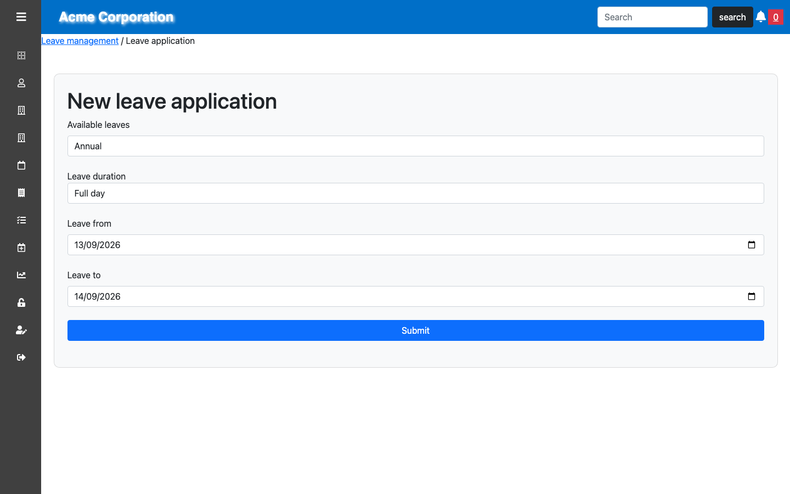
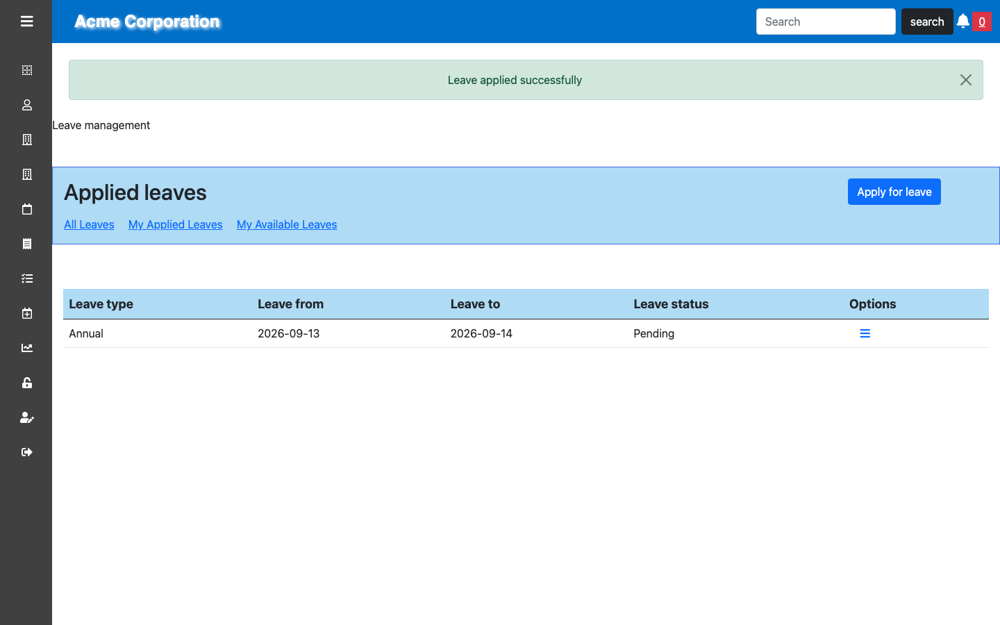
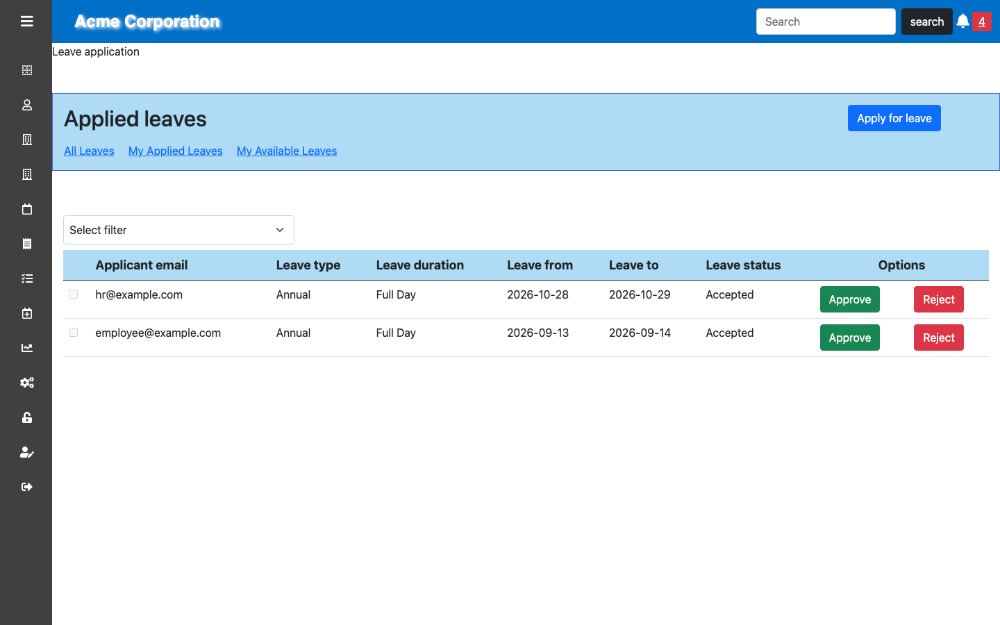

# The leave approval flow

Four screens from the Acme demo tenant, in order. Every page below is scoped to
one company by the default scope described in
[tenant-isolation.md](tenant-isolation.md) — nothing on them is filtered by
hand.

These were captured by driving a real browser against the running application
and signing in as each role, not assembled from a design. The dates are
relative to the capture, which is why they sit in September 2026.

## 1. An employee applies

`employee@example.com` at `/members/4/applied_leaves/new`.



The **Available leaves** select offers only the types this employee still has a
balance for — it reads `user_leaves` joined to `leaves` where
`remaining_count > 0`, so a type that has been used up does not appear. **Leave
duration** offers full or half day, and nothing else: the values behind it are
`{ full_day: 1, half_day: 2 }`, and a request carrying anything else is now
rejected by a validation rather than stored.

## 2. It lands as pending



The application starts in `pending`. This is the applicant's own list, so it
shows their requests and nothing else. Two things happen on create: an email to
the approver, and an in-app notification — the bell in the header carries the
count.

The state machine has three states and two events:

```ruby
state_machine initial: :pending do
  state :pending
  state :accepted
  state :rejected

  event :request_accepted, success: %i[create_approval_notification send_approval_email] do
    transitions to: :accepted, from: :pending, guard: :validate_leave_count, on_transition: :approve_leave
  end
  event :request_rejected, success: %i[create_rejection_notification send_rejection_email] do
    transitions to: :rejected, from: :pending
  end
end
```

## 3. HR sees the company-wide queue

`hr@example.com` at `/applied_leaves/all_applied_leaves`.


Same table, different scope: HR sees every applicant in the tenant, and only in
the tenant. The **Approve** and **Reject** controls are rendered per row by
`can?(:approve_leave, applied_leave)` rather than by a role check in the view,
so the buttons and the actions behind them are decided by the same CanCanCan
rules.

The checkboxes are for bulk action — the approve and reject buttons above the
table appear once rows are selected — and a checkbox is disabled on any row
that is not `pending`, since neither transition accepts a request that has
already been decided.

## 4. Approved



The transition is guarded. `validate_leave_count` re-checks the balance at the
moment of approval rather than trusting the check made when the request was
filed, so an employee whose balance was spent by an approval in between cannot
be approved into a negative one:

```ruby
def validate_leave_count
  raise ArgumentError unless leave_available?

  true
end
```

Both lines are deliberate. It raises rather than returning false so the
controller can tell an exhausted balance apart from an invalid transition and
say so. And it returns `true` rather than falling through to `nil`, because the
transitions gem reads a `nil` guard as "not executable" and skips the
transition without a word. That was one of the three defects found in phase 1,
and it has a regression spec holding it.

Approval draws the days off the balance, writes the accepted state, and sends
the approval email and notification — the `success:` callbacks on the event.
